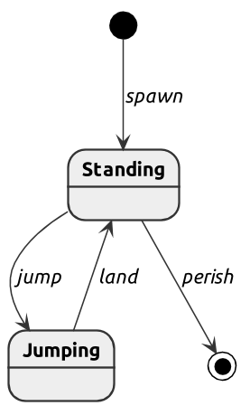

# motor-diagrams

Generate state diagrams from Motor FSM typeclasses.

**This package is experimental!**

## Example



## Usage

First, use `reflectEvents` on your FSM typeclass to obtain a
value-level representation:

``` haskell
data Open
data Closed

class MonadFSM m => Door (m :: Row * -> Row * -> * -> *) where
  type State m :: * -> *
  initial
    :: Name n
    -> Actions m '[n !+ State m Open] r ()
  close
    :: Name n
    -> Actions m '[n :-> State m Open !--> State m Closed] r ()
  open
    :: Name n
    -> Actions m '[n :-> State m Closed !--> State m Open] r ()
  end
    :: Name n
    -> Actions m '[n !- State m Closed] r ()

reflectEvents ''Door "doorEvents"
```

Then, use `Motor.FSM.Diagram.renderPlantUmlToFile` to render it
as a PlantUML state diagram:

``` haskell
main :: IO ()
main =
  renderPlantUmlToFile
    "door.uml.txt"
    doorEvents
```

Or, use the Template Haskell wrapper
`Motor.FSM.Diagram.TH.renderPlantUmlToFile` to write the file when
compiling the module (this requires the reflection to happen in another
module):

``` haskell
$(renderPlantUmlToFile
    "door.uml.txt"
    doorEvents)
```

Last, render in your format of choice using the PlantUML JAR file:

``` shell
java -jar plantuml.jar -tpng door.uml.txt -o door.png
```

For an example how to automate the last step with Make, see [this
Makefile](Makefile).

## License

Mozilla Public License Version 2.0, see `LICENSE` file in each
package.
